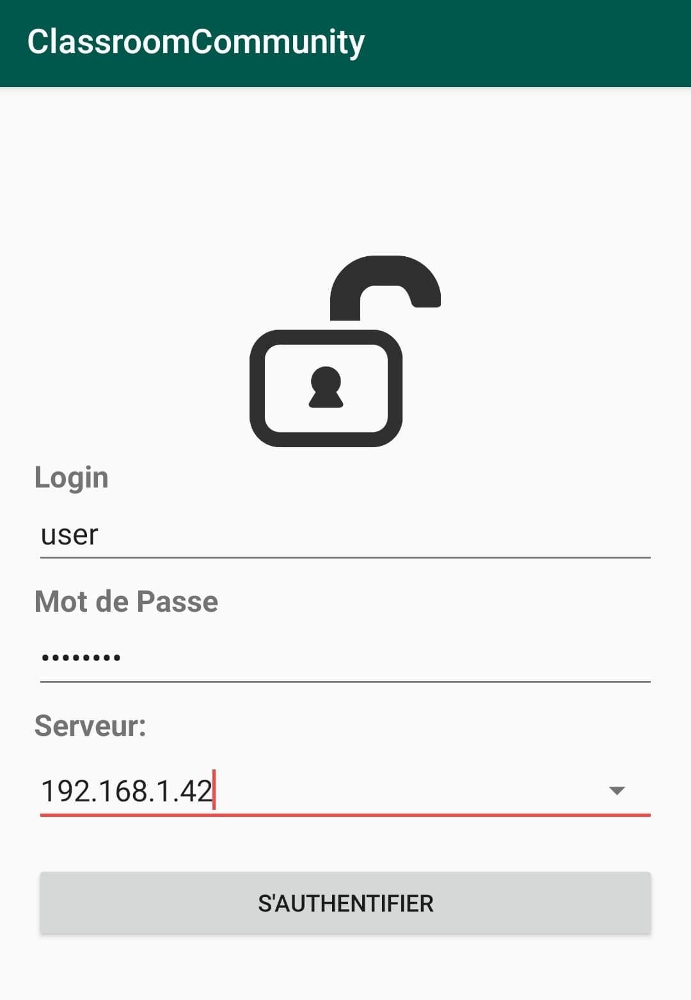

# ClassroomQuizz (Local)

## Description

ClassroomQuizz est un projet android développé sous Android Studio en Java dont le but est de proposer à l'utilisateur finale de pouvoir repondre à des questions à choix multiple avec un temps donné, ou alors à une question précise sur l'un des vingts arrondissements de Paris.

## Installation

Pour installer le projet il faut d'abord créer un serveur avec la base SQL classroom_db ainsi que l'API classroom server.
Puis il faut installer l'apk et donner le droit à l'application d'accéder au fichier et dossier de l'appareil.
Au lancement de l'application celle-ci vous demandera de rentrer un login et un mot de passe, vous pouvez entrer "user" et "password".
Puis plus bas il faudra renseigner l'adresse du serveur et vous pourrez vous connecter

  

Tout les fichiers nécessaires sont disponible dans le dossier "build"

## Caractéristiques

* Connection
* QCM
* Question par arrondissement de Paris
* Liste d'amis

## Technologies Utilisées

* Java
* xml
* PHP
* SQL

## Outils utilisée

* Android Studio
* Visual Studio Code
* XAMPP

# Limites
Ce projet est avant tout un projet à but pédagogique, de ce fait celui-ci est peu complet et beaucoup de fonctionnalités manques dont la plus importante est le multijoueur. Cependant cette fonctionnalité est disponible sur [ClassroomQuizz](https://github.com/espritdufeu/ClassroomQuizz) (ou pas)